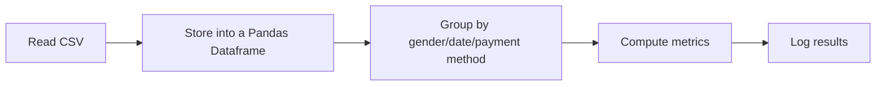

## Design Document: Aggregation and grouping using Java Streams

### 1. Overview

This program reads from a CSV file containing customer shopping data, and performs the following analyses:

- Population count by gender
- Total sales grouped by gender
- Most used payment method
- Day with the most sales

The output will be printed to the console and written to a file

### 2. Goals

- Read structured CSV data into memory
- Perform grouped aggregations
- Summarize and display results

### 3. Data and Assumptions

**Input:** CSV file with columns like:

```
invoice_no,customer_id,gender,age,category,quantity,price,payment_method,invoice_date,shopping_mall
I138884,C241288,Female,28,Clothing,5,1500.4,Credit Card,5/8/2022,Kanyon
```

**Assumptions**:

- All columns are present and will be in the above format
- CSV will have content
- Quantity and price are numeric
- Date is in format of DD/MM/YYY

### 4. High-level Design

#### 4.1 Flow Design



#### 4.2 Components

1. CSV Reader

- `read_csv()` in Python

2. Data Storage

- Pandas Dataframe

3. Functions

- count_population_by_gender(df)
- total_sales_by_gender(df)
- most_used_payment_method(df)
- day_with_most_sales(df)

4. Main progam

- Calls functions in order and prints results

### 5. Testing plan

- Test input: Create a small CSV with my own values
- Expected output: Verify as per test data CSV
- Edge cases:
  - Empty dataframe -> outputs "Warning dataframe is empty!"
  - There are multiple payment methods that are the most used (have same count)
  - There are multiple days that have the most sales (have same amount)

### 6. Files/Folders

- **/CSVs:** holds the CSV files that will be accessed in by the programs
- **data_analyzer.py:** contains the ShoppingDataAnalyzer class that loads the CSV and performs all data analysis operations
- **assignment1_tests.py:** test cases for ShoppingDataAnalyzer class
- **assignment1.py:** invokes ShoppingDataAnalyzer to execute all required tasks from the assignment

### 7. How to run

1. Python 3.10.0+ needs to be installed
2. Install dependencies:

- `pip install pandas`

3. Run the main file:

- `python3 assignment1.py`, results are printed to console

4. Run the tests:

- `python3 assignment1_tests.py`
