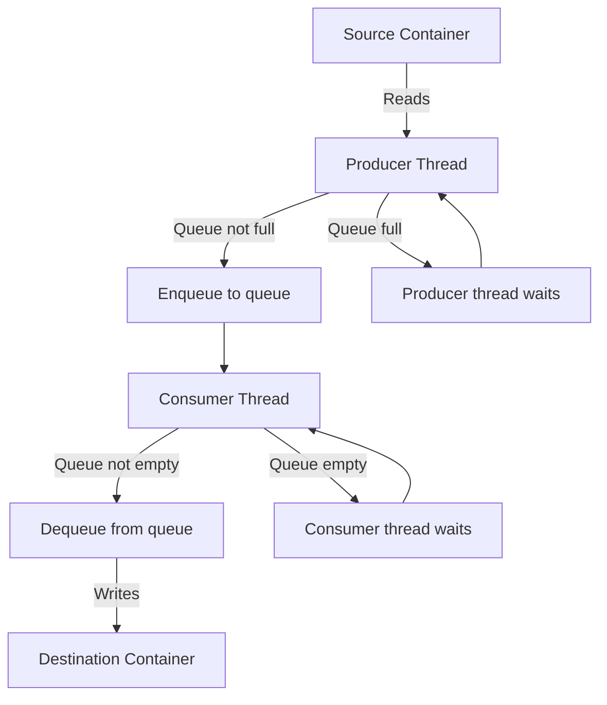

## Design Document: Producer Consumer problem

### 1. Overview

This program creates a source, a destination container, a queue, and 2 classes (Producer and Consumer) in which:

- The producer will read from the source container and enqueue the queue. If the queue is full, producer will wait.
- The consumer will dequeue from the queue and populate the destination container. If the queue is empty, consumer will wait.

The output will be printed to the console.

### 2. Goals

- Create a source and destination container with the same length/capacity and can store both integers and doubles
- Create a queue with half the capacity of the source and destination container
- Write a producer class that will read from the source container and enqueue the queue if it's not full.
- Write a consumer class that will dequeue from the queue if it's not empty and populate the destination container.

### 3. Data and Assumptions

**Input:** None provided

**Assumptions:**

- Consumer can consume as soon as at least one item is available in the queue
- Producer can produce as long as there is space in the queue

### 4. High-level Design

#### 4.1 Flow Design

### 4.2 Components

1. Source Container

- List type
- Initialize and populate with data
- Size of n

2. Queue

- Buffer for producer and consumer
- Create using the Python Queue library
- Length of `math.ceil(n/2)`
- Handles all thread locking internally

3. Destination container

- List type
- Initialize
- Populate using the consumer class
- Size of n

4. Producer

- Producer class
- Has a source container shared index that will be accessed with a lock for no race conditions if multiple instances of producers
- Reads from the source container at the shared index, enqueue to queue, and then increment shared index

5. Consumer

- Consumer class
- Has a destination container shared index that will be accessed with a lock for no race conditions if multiple instances of consumers
- Deqeueues the queue, writes to destination container at the shared index, and then increment shared index

### 5. Testing Plan

- Test input:
  - Create a source container with a random number of elements and random integers and doubles
  - Create a destination container with same size/capacity as source container
  - Create a queue with half the size/capacity of the source/destination container
- Expected output: Source is equal to destination
- Edge cases:
  - Full queue for producer
  - Empty queue for consumer
  - Source of size 0
  - Source of size 1

### 6. Files/Folders

- **producer_consumer.py:** file for the producer and consumer class that follow the instructions given in the **README2.md**
- **assignment2_tests.py:** file for test cases
- **assignment2.py:** invokes the Producer and Consumer classes to execute all required tasks from the assignment

### 7. How to run

1. Python 3.10.0+ needs to be installed

2. Run the main file:

- `python3 assignment2.py`, results are printed to console

3. Run the tests:

- `python3 assignment2_tests.py`
